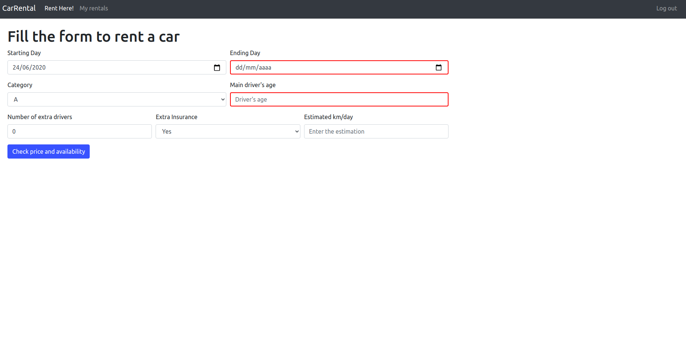

# Exam #1: "Car Rental"
## Student: s273693 VASCONCELLOS HENRIQUE 

## React client application routes

- Route `/home`: initial page, available for logged out and in users, shows all cars and allows applying the filters
- Route `/renthere`: available for logged in users, provides the form to check availability and price of rental, as well as the form to proceed with payment
- Route `/myrentals`: available for logged in users, shows a table with all the user's past and future rentals, as well as the possibility to cancel the future ones
- Route `/login`: available for logged out users, shows the form for logging in (inserting nickname and password)

## REST API server

OBS: All response bodies have the error content in case of errors, below is only specified the content in case of success

- POST `/api/login`
  - nickname and password on the request body content
  - response body content: user's id, name, lastname and nickname

- POST `/api/logout`
  - No parameters on the request or response body, only clear the cookies

- GET `/api/cars`
  - request parameters: none
  - response body content: all cars registered on the Database ordered by category, brand, model

- GET `/api/user`
  - request parameters: logged in user's id (sent via cookie)
  - response body content: user's id, name, lastname and nickname

- GET `/api/rentals`
  - request parameters: logged in user's id (sent via cookie)
  - response body content: the whole table of rentals that have that user's id as foreign key, plus the car model and category of each rental

- GET `/api/cars/available`
  - request parameters: start date, end date and car category passed as query parameters
  - response body content: all cars available at that time period for that category

- POST `/api/payment`
  - request body content: full name, card number, CVV code and price
  - response body content: message of success or failure of the payment procedure

- POST `/api/rentals`
  - request body content: the fields corresponding to the columns of the rentals table in the DB (these fields are in the next topic)
  - response body content: id of the just added rental

- DELETE `/api/rentals/:rentalId`
  - request parameters: the id of the rental to be deleted from the DB
  - response body content: none

## Server database

OBS: PK = Primary key; FK = Foreign key

- Table `users` - contains id (PK), nickname, name, lastname, hash - Event though the information about the name and last name are not used in the application, it makes sense to store this kind of information about the users; the hash column keeps the hashes for the users' passwords

- Table `cars` - contains id (PK), model, brand, category - Stores the information about the cars of the catalogue

- Table `rentals` - contains id (PK), startDate, endDate, user (FK), car (FK), driverAge, extraDrivers, km_day, insurance, price - Stores the informations about the rentals, associating each one of them with the respective user and car

## Main React Components

- `App` (in `App.js`): responsible for most of the control, maintains the most important state variables of the application and passes them as props to the components listed below; also has all the methods that call APIs, and some other ones that are also passed as props to the other components

- `Header` (in `Navbar.js`): renders the navigation bar of the application, with the links to the different routes; also calls the getUserRentals method and the logoutUser method

- `Filters` (in `Filters.js`): renders the filter side bar for the home page, receiving the brands and categories as props and calls the methods responsible for updating the filter applied each time a check box changes

- `CarList` (in `CarList.js`): renders the list of cars available in the catalogue according to the filters selected

- `LoginForm` (in `LoginForm.js`): renders the form to input the nickname and the password, redirecting to the home page in case of success or showing an error message in case of failure

- `RentalList` (in `RentalList.js`): renders the rentals for the logged in user, and also classifies them in finished or future. Also presents the cancel button for the non yet started rentals, which calls the method for deleting the rental from the DB

- `FormsControl` (in `FormsControl.js`): component responsible for rendering the rent form (in `RentForm.js`) and the payment form (in `PaymentForm.js`), has the methods for updating their values in case of changes, handles the submission of both forms and also has the function to calculate the price of a rent and check if customer is frequent.

(only _main_ components, minor ones may be skipped)

## Screenshot

## Test users

* user1, admin1 (frequent customer)
* user2, admin2
* user3, admin3
* user4, admin4
* user5, admin5